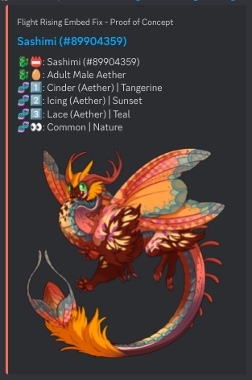

# Flight Rising Embed
## A fix for Flight Rising dragon profile embeds on Discord

### Demo

### Initial disclaimer
This project is currently in the proof of concept stage and will not be "published" for public use before consulting at least a portion of the game's community and, of course, sending a support ticket to confirm whether this is okay with Flight Rising's team. As I hope to make clear in the [Mission Statement](#mission-statement) section of this readme, I do not intend to break point 13 of the "Conduct" section of the [Flight Rising Terms of Use](https://flightrising.com/main.php?p=wiki&article=81), and I will take all the steps necessary to reduce this tool's load on Flight Rising's servers before making it publicly accessible.

### Mission statement
As of 2023-10-28, Discord does not embed Flight Rising dragon profile links. While Flight Rising does provide the necessary meta tags for embeds in other platforms, it does not provide the ones necessary for Discord's significantly flawed embed parsing. Regardless, the embed information Flight Rising does provide seems more geared towards hopefully attracting new players to the game (a good thing!) rather than providing useful information for the already established playerbase (which would be good for other reasons!).

This tool hopes to solve both of those issues by giving users the option to embed a card with information they would normally have to copy manually, such as the dragon's image and genes, right in Discord. This would, at the very least, represent a quality-of-life improvement for the dedicated portion of Flight Rising's playerbase that coordinates dragon sales through community Discord servers; and, in the best-case scenario, I believe it could even slightly reduce load on the FR servers by making it unnecessary for multiple players to click the link (and load the entire site) just to check a dragon's genes and/or colors.

It will achieve this by dynamically generating a redirect page and filling in its meta tags on-demand using information extracted from a portion of a dragon profile's raw HTML file (javascript proof of concept [here](fetch.js)).  Ideally, this would condense all of the required "scraping" into two HTTP GET requests: one for the raw HTML file (~300kb), and one for the thumbnail image (~150kb), which should be more efficient than, for instance, a player loading the entire website (~4.5mb, in my tests) to get the same information. Moreover, thanks to Discord's aggressive caching of embed thumbnails, these requests would only be necessary roughly once every 30 minutes until the embed card leaves all users' viewports: ideally, this would mean hundreds of users could be served by these same two requests! I currently intend to rely on Discord's caching but, in case it proves insufficient to avoid the possibility of overloading FR servers with these requests, I will handle caching wherever I host the tool.

The tool will only function as a forwarder. It will not request or store any information that is not already available to logged-out users visiting Flight Rising's website. It will *not* have a frontend, it will *not* store any logs, it will *not* host any persistent information, and there will *not* be any fields where users could even theoretically input their account credentials by mistake. Therefore, it would not be possible for it to be used to steal account information or for any malicious purposes either by me or a third party.

My intent with creating this tool is just to give back to a community that has been nothing but delightful to me since I joined, and to hopefully improve a lot of people's experiences when talking about our favorite dragon png website. This project is made in good faith and no breach of the Flight Rising Terms of Use or Stormlight Workshop LLC's copyright over Flight Rising is intended.

### Takedowns?
*I will comply with any takedown requests by Stormlight Workshop LLC if they consider that this tool breaks Flight Rising's Terms of Use.*

I would, however, like to use this opportunity to kindly request a chance to discuss this with FR's Engineering team before such a request is issued, as this project is done completely in good faith and a I genuinely believe it could represent a significative quality-of-life improvement for Flight Rising's community. At the very least, I would like to request that no punitive action be taken against my partner's account, with whom I share an IP address, if this is considered a bannable offense for my account.

Thanks!

### Copyright
Flight Rising is © 2013 - 2023 Stormlight Workshop, LLC. All Rights Reserved to Stormlight Workshop.

The code contained in this repository is licensed under the Opinionated Queer License v1.1.
